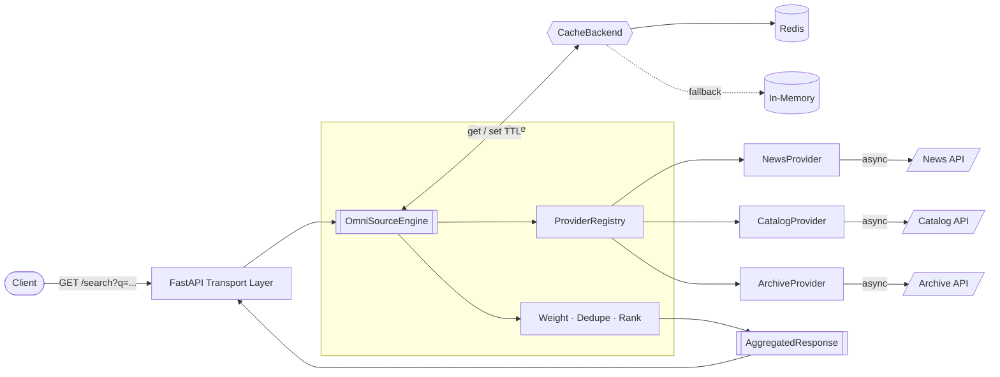
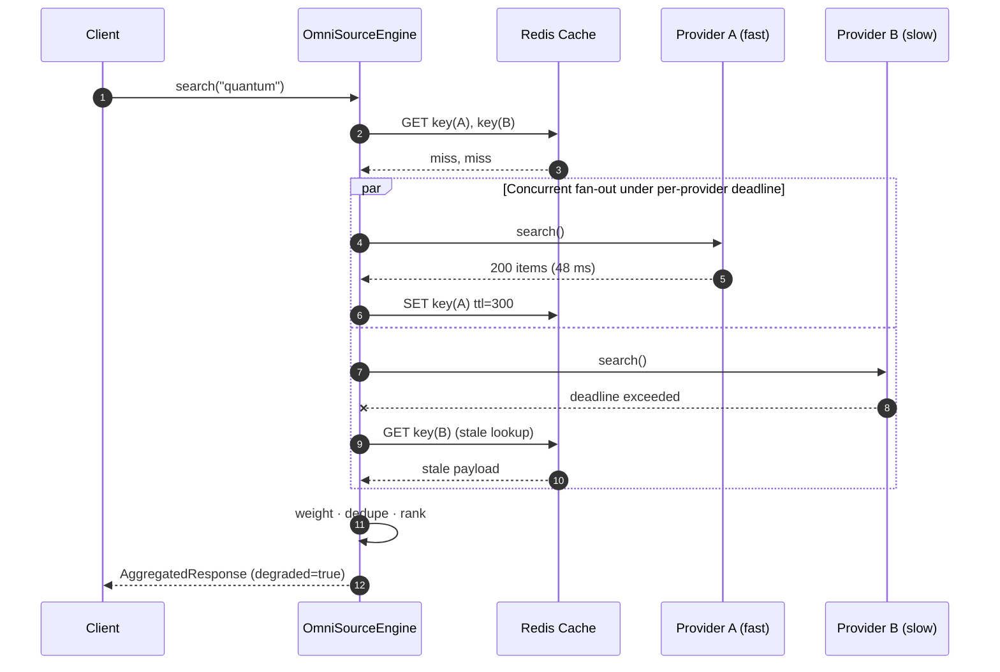

<div align="center">


# OmniSource

### Resilient, async multi-source aggregation engine

[](https://github.com/iamsmmh/OmniSource/actions/workflows/ci.yml)
[](pyproject.toml)
[](https://github.com/astral-sh/ruff)
[](http://mypy-lang.org/)
[](LICENSE)
[](Dockerfile)

Query many external sources **in parallel**, survive their failures, and return **one standardized response**.

</div>

---

## ✨ Why OmniSource

| Capability | What it means |
| --- | --- |
| **Parallel fan-out** | Every registered provider is queried concurrently; total latency ≈ the slowest *surviving* provider, not the sum. |
| **Hard deadlines** | Each provider runs under its own `asyncio.wait_for` budget. A hung upstream can't stall the request. |
| **Graceful fallback** | On timeout or error the engine serves the last known-good cached payload — otherwise it skips the provider. The pipeline never crashes. |
| **Async Redis cache** | TTL-based caching via `redis.asyncio`, with an in-memory backend for tests and single-node runs. Cache outages degrade *performance*, never correctness. |
| **Clean architecture** | Providers know nothing about caching or concurrency; the engine knows nothing about HTTP; the API is a thin transport shell. |
| **Strict typing** | `mypy --strict` across the package, Pydantic v2 frozen models, `py.typed` shipped. |

---

## 🏗 Architecture



### Request lifecycle



### Layout

```
src/omnisource/
├── core/            # Domain: config, models, exceptions, engine
│   ├── config.py    # Env-driven Settings (OMNISOURCE_*)
│   ├── models.py    # Frozen Pydantic schemas — the standardized contract
│   ├── engine.py    # Fan-out, deadlines, fallback, merge
│   └── exceptions.py
├── providers/       # Adapters
│   ├── base.py      # BaseProvider ABC: search / get_metadata / health_check
│   ├── registry.py  # Name-unique composition seam
│   └── samples.py   # News / Catalog / Archive reference providers
├── cache/           # Infrastructure
│   ├── base.py      # CacheBackend ABC + key helpers
│   ├── redis_cache.py
│   └── memory_cache.py
└── api/app.py       # FastAPI transport
```

---

## 🚀 Quick start

```bash
git clone https://github.com/iamsmmh/OmniSource.git
cd OmniSource
python -m venv .venv && source .venv/bin/activate
pip install -e ".[dev]"

uvicorn omnisource.api.app:app --reload --host 0.0.0.0 --port 8000
```

Open <http://localhost:8000/docs> for interactive OpenAPI docs.

### Docker

```bash
docker compose up --build          # app on :8000 + redis on :6379
docker compose logs -f app
```

### Configuration

All settings are environment variables prefixed with `OMNISOURCE_` (or a `.env` file).

| Variable | Default | Description |
| --- | --- | --- |
| `OMNISOURCE_PROVIDER_TIMEOUT` | `3.0` | Per-provider deadline in seconds |
| `OMNISOURCE_MAX_CONCURRENCY` | `32` | Max simultaneous provider calls |
| `OMNISOURCE_MAX_ITEMS` | `100` | Cap on aggregated items |
| `OMNISOURCE_REDIS_URL` | `redis://localhost:6379/0` | Redis connection URL |
| `OMNISOURCE_CACHE_ENABLED` | `true` | Toggle caching entirely |
| `OMNISOURCE_CACHE_TTL` | `300` | Cache TTL in seconds |
| `OMNISOURCE_LOG_LEVEL` | `INFO` | Logging verbosity |

---

## 🔌 API

| Method | Endpoint | Description |
| --- | --- | --- |
| `GET` | `/search` | Aggregated search across providers |
| `GET` | `/providers` | List registered provider names |
| `GET` | `/providers/health` | Per-provider health probes |
| `GET` | `/providers/{provider}/items/{item_id}` | Metadata for one entity |
| `GET` | `/health` | Service + cache + provider liveness |

### `GET /search`

| Param | Type | Default | Notes |
| --- | --- | --- | --- |
| `q` | string | — | **required**, 1–256 chars |
| `providers` | string[] | all | Repeatable; restricts fan-out |
| `limit` | int | `25` | 1–500 |
| `timeout` | float | settings | Per-provider deadline override |
| `use_cache` | bool | `true` | Bypass cache when `false` |

```bash
curl "http://localhost:8000/search?q=quantum&limit=3&providers=news&providers=catalog"
```

```json
{
  "query": "quantum",
  "items": [
    {
      "id": "news-0",
      "title": "quantum result #1 from news",
      "url": "https://news.example.com/items/0",
      "score": 1.2,
      "provider": "news",
      "extra": { "rank": 1 }
    }
  ],
  "results": [
    { "provider": "news",    "status": "ok",      "latency_ms": 51.4,  "from_cache": false, "error": null },
    { "provider": "catalog", "status": "cached",  "latency_ms": 0.9,   "from_cache": true,  "error": null },
    { "provider": "archive", "status": "timeout", "latency_ms": 300.2, "from_cache": false, "error": "exceeded 0.3s deadline" }
  ],
  "degraded": true,
  "total": 3,
  "elapsed_ms": 52.8,
  "generated_at": 1772496000.0
}
```

`status` is one of `ok`, `cached`, `timeout`, `error`, `skipped`. A response where any provider is non-fresh has `degraded == true` — **the request still returns `200`**.

### Library usage

```python
import asyncio

from omnisource import OmniSourceEngine
from omnisource.cache import RedisCache
from omnisource.providers import CatalogProvider, NewsProvider, ProviderRegistry


async def main() -> None:
    registry = ProviderRegistry([NewsProvider(), CatalogProvider()])
    async with OmniSourceEngine(registry, cache=RedisCache("redis://localhost:6379/0")) as engine:
        response = await engine.search("quantum", limit=10, timeout=2.0)
        for item in response.items:
            print(f"{item.score:>6.3f}  {item.provider:<8} {item.title}")


asyncio.run(main())
```

### Writing a provider

```python
from collections.abc import Sequence

import httpx

from omnisource.core.exceptions import ProviderUnavailableError
from omnisource.core.models import HealthReport, ProviderMetadata, SearchItem
from omnisource.providers import BaseProvider


class GitHubProvider(BaseProvider):
    name = "github"
    weight = 1.1

    def __init__(self) -> None:
        super().__init__()
        self._client = httpx.AsyncClient(base_url="https://api.github.com", timeout=5.0)

    async def search(self, query: str) -> Sequence[SearchItem]:
        try:
            response = await self._client.get("/search/repositories", params={"q": query})
            response.raise_for_status()
        except httpx.HTTPError as exc:
            raise ProviderUnavailableError(self.name, str(exc)) from exc
        return [
            SearchItem(
                id=str(repo["id"]),
                title=repo["full_name"],
                url=repo["html_url"],
                score=min(repo["stargazers_count"] / 10_000, 1.0),
                provider=self.name,
            )
            for repo in response.json()["items"]
        ]

    async def get_metadata(self, id: str) -> ProviderMetadata: ...
    async def health_check(self) -> HealthReport: ...

    async def close(self) -> None:
        await self._client.aclose()
```

Register it with `engine.register(GitHubProvider())` — no engine changes required.

---

## 🧪 Development

```bash
ruff check .            # lint
ruff format --check .   # formatting
mypy                    # strict type check
pytest --cov            # unit tests + coverage
```

CI runs all four on every pull request across Python 3.11 and 3.12, then builds and smoke-tests the Docker image.

> [!IMPORTANT]
> The CI pipeline is currently parked at [`docs/ci.yml.txt`](docs/ci.yml.txt) because the automation
> account that opened this branch lacks the GitHub `workflows` permission. To activate it:
>
> ```bash
> git mv docs/ci.yml.txt .github/workflows/ci.yml
> git commit -m "ci: activate quality pipeline"
> ```
>
> Or paste its contents into **Actions → New workflow** in the GitHub web UI. The CI badge above
> starts reporting once the file lands on `main`.

---

## 📱 iOS sideloading feeds

This repository also hosts the original auto-updating AltStore feed collection — see [`docs/FEEDS.md`](docs/FEEDS.md).

## 📄 License

Distributed under the terms of the [LICENSE](LICENSE) file.
