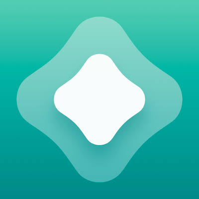

<div align="center">

<a href="https://github.com/iamsmmh/OmniSource">
  
</a>

# 🌐 OmniSource

**Automated iOS Sideloading Feed Repository**

[](https://github.com/iamsmmh/OmniSource/actions)
[](LICENSE)
[](https://github.com/iamsmmh/OmniSource/stargazers)
[](https://github.com/iamsmmh/OmniSource/issues)

**Unified • Automated • Organized**

A centralized collection of curated application feeds maintained through GitHub Actions and distributed across multiple iOS sideloading platforms.

</div>

---

## 🚀 Supported Clients

<div align="center">

| Client | Logo |
|---------|---------|
| AltStore |  |
| SideStore |  |
| LiveContainer |  |
| Feather |  |
| ESign |  |
| Signulous |  |

</div>

> [!TIP]
> Tap the AltStore or SideStore logo for automatic import. For LiveContainer, Feather, ESign, and Signulous, copy the Raw URL and add it manually as a repository.

---

## 📦 Available Sources

| App | AltStore | SideStore | LiveContainer | Raw URL |
|------|:------:|:------:|:------:|------|
|  **OmniSource Master** | <a href="https://altstore.io/source?url=https%3A%2F%2Fraw.githubusercontent.com%2Fiamsmmh%2FOmniSource%2Fmain%2Fapps.json"></a> | <a href="https://altstore.io/source?url=https%3A%2F%2Fraw.githubusercontent.com%2Fiamsmmh%2FOmniSource%2Fmain%2Fapps.json"></a> | <a href="https://raw.githubusercontent.com/iamsmmh/OmniSource/main/apps.json"></a> | `apps.json` |
|  **SpotiFLAC Mobile** | <a href="https://altstore.io/source?url=https%3A%2F%2Fraw.githubusercontent.com%2Fiamsmmh%2FOmniSource%2Fmain%2Fspotiflac.json"></a> | <a href="https://altstore.io/source?url=https%3A%2F%2Fraw.githubusercontent.com%2Fiamsmmh%2FOmniSource%2Fmain%2Fspotiflac.json"></a> | <a href="https://raw.githubusercontent.com/iamsmmh/OmniSource/main/spotiflac.json"></a> | `spotiflac.json` |
|  **YTLite** | <a href="https://altstore.io/source?url=https%3A%2F%2Fraw.githubusercontent.com%2Fiamsmmh%2FOmniSource%2Fmain%2Fytlite.json"></a> | <a href="https://altstore.io/source?url=https%3A%2F%2Fraw.githubusercontent.com%2Fiamsmmh%2FOmniSource%2Fmain%2Fytlite.json"></a> | <a href="https://raw.githubusercontent.com/iamsmmh/OmniSource/main/ytlite.json"></a> | `ytlite.json` |
|  **YTKillerPlus** | <a href="https://altstore.io/source?url=https%3A%2F%2Fraw.githubusercontent.com%2Fiamsmmh%2FOmniSource%2Fmain%2Fytkp.json"></a> | <a href="https://altstore.io/source?url=https%3A%2F%2Fraw.githubusercontent.com%2Fiamsmmh%2FOmniSource%2Fmain%2Fytkp.json"></a> | <a href="https://raw.githubusercontent.com/iamsmmh/OmniSource/main/ytkp.json"></a> | `ytkp.json` |
|  **YouPro** | <a href="https://altstore.io/source?url=https%3A%2F%2Fraw.githubusercontent.com%2Fiamsmmh%2FOmniSource%2Fmain%2Fyoupro.json"></a> | <a href="https://altstore.io/source?url=https%3A%2F%2Fraw.githubusercontent.com%2Fiamsmmh%2FOmniSource%2Fmain%2Fyoupro.json"></a> | <a href="https://raw.githubusercontent.com/iamsmmh/OmniSource/main/youpro.json"></a> | `youpro.json` |
|  **YouMod** | <a href="https://altstore.io/source?url=https%3A%2F%2Fraw.githubusercontent.com%2Fiamsmmh%2FOmniSource%2Fmain%2Fyoumod.json"></a> | <a href="https://altstore.io/source?url=https%3A%2F%2Fraw.githubusercontent.com%2Fiamsmmh%2FOmniSource%2Fmain%2Fyoumod.json"></a> | <a href="https://raw.githubusercontent.com/iamsmmh/OmniSource/main/youmod.json"></a> | `youmod.json` |
|  **YTKACE** | <a href="https://altstore.io/source?url=https%3A%2F%2Fraw.githubusercontent.com%2Fiamsmmh%2FOmniSource%2Fmain%2Fytkace.json"></a> | <a href="https://altstore.io/source?url=https%3A%2F%2Fraw.githubusercontent.com%2Fiamsmmh%2FOmniSource%2Fmain%2Fytkace.json"></a> | <a href="https://raw.githubusercontent.com/iamsmmh/OmniSource/main/ytkace.json"></a> | `ytkace.json` |
|  **YTMusicUltimate** | <a href="https://altstore.io/source?url=https%3A%2F%2Fraw.githubusercontent.com%2Fiamsmmh%2FOmniSource%2Fmain%2Fytmusic.json"></a> | <a href="https://altstore.io/source?url=https%3A%2F%2Fraw.githubusercontent.com%2Fiamsmmh%2FOmniSource%2Fmain%2Fytmusic.json"></a> | <a href="https://raw.githubusercontent.com/iamsmmh/OmniSource/main/ytmusic.json"></a> | `ytmusic.json` |

---

## 📲 Installation

1. Tap the **AltStore** or **SideStore** logo to import automatically.
2. For **LiveContainer**, **Feather**, **ESign**, and **Signulous**, copy the Raw URL and add it as a repository/source.
3. Refresh sources and install your preferred application.

> [!TIP]
> The **OmniSource Master Feed** contains all available applications and is recommended for most users.

---

> [!WARNING]
> ### YouTube Bundle Identifier Conflicts
>
> All modified YouTube variants use:
>
> `com.google.ios.youtube`
>
> Completely uninstall any existing YouTube variant before installing a different version to avoid update conflicts and signing issues.

---

> [!NOTE]
> Some applications may display entitlement warnings depending on your signing method. This is expected in certain sideloading environments.

---

## ⚙️ Automation Pipeline

```text
Upstream Sources
        │
        ▼
 GitHub Actions
        │
        ▼
 Process & Validate
        │
        ▼
 OmniSource Feeds
        │
        ▼
 AltStore • SideStore • LiveContainer
 Feather • ESign • Signulous
```

---

## 📂 Repository Resources

- 📦 [Feed Manifests](https://github.com/iamsmmh/OmniSource/tree/main)
- ⚙️ [GitHub Actions](https://github.com/iamsmmh/OmniSource/actions)
- 📜 [License](https://github.com/iamsmmh/OmniSource/blob/main/LICENSE)
- 🐛 [Issues](https://github.com/iamsmmh/OmniSource/issues)
- ⭐ [Star Repository](https://github.com/iamsmmh/OmniSource)

---

## 🙌 Credits

- 🐧 [MountainofPenguin](https://github.com/MountainofPenguin) — Repository structure inspiration.
- 🛡️ [HakujouSan](https://www.reddit.com/user/HakujouSan/) — Community testing and feedback.
- 🛠️ [Avieshek](https://code.forgejo.org/avieshek) — Manifest parsing and debugging assistance.
- ⚙️ [S M Mahbub Hossain](https://github.com/iamsmmh) — Development, automation, and maintenance.

---

## ⚖️ Disclaimer

OmniSource is an independent community project.

All trademarks, logos, product names, and copyrighted materials belong to their respective owners. OmniSource does not host application binaries directly and does not claim ownership of third-party software referenced by repository feeds.

Users are solely responsible for complying with applicable laws, software licenses, and platform policies.

---

<div align="center">

### 🌐 OmniSource

**Automated • Organized • Unified**

⭐ Star the repository if you find it useful.

</div>
