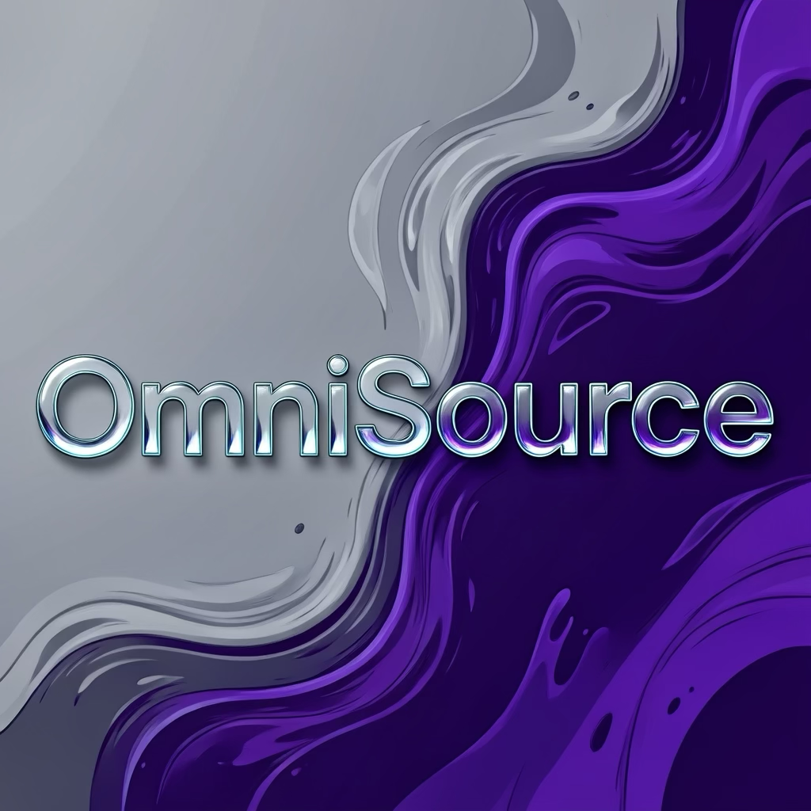
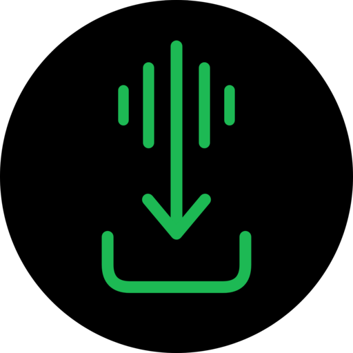

# 🌐 OmniSource

**Automated iOS Sideloading & Android Module Feed Repository**

A centralized collection of application feeds and manifests maintained with GitHub Actions.

---

## ⚡ Master Source

**Raw Feed**

https://raw.githubusercontent.com/iamsmmh/OmniSource/main/apps.json

**AltStore**

[➕ Add OmniSource to AltStore](altstore://source?url=https%3A%2F%2Fraw.githubusercontent.com%2Fiamsmmh%2FOmniSource%2Fmain%2Fapps.json)

**SideStore**

[➕ Add OmniSource to SideStore](sidestore://source?url=https%3A%2F%2Fraw.githubusercontent.com%2Fiamsmmh%2FOmniSource%2Fmain%2Fapps.json)

> 💡 The Master Feed is the recommended source.

---

## 🚀 Available Feeds

| Logo | Feed | Platform | Manifest |
|:---:|:---|:---:|:---:|
|  | **YouPro** | iOS | [youpro.json](https://github.com/iamsmmh/OmniSource/blob/main/youpro.json) |
|  | **YTLite** | iOS | [ytlite.json](https://github.com/iamsmmh/OmniSource/blob/main/ytlite.json) |
|  | **YTKillerPlus** | iOS | [ytkp.json](https://github.com/iamsmmh/OmniSource/blob/main/ytkp.json) |
|  | **YouMod** | iOS | [youmod.json](https://github.com/iamsmmh/OmniSource/blob/main/youmod.json) |
|  | **YTKACE** | iOS | [ytkace.json](https://github.com/iamsmmh/OmniSource/blob/main/ytkace.json) |
|  | **YTMusicUltimate** | iOS | [ytmusic.json](https://github.com/iamsmmh/OmniSource/blob/main/ytmusic.json) |
|  | **SpotiFLAC Mobile** | iOS | [spotiflac.json](https://github.com/iamsmmh/OmniSource/blob/main/spotiflac.json) |
|  | **OmniSource Master** | Unified | [apps.json](https://github.com/iamsmmh/OmniSource/blob/main/apps.json) |

---

## 🔗 Direct Raw Feeds

| Feed | Raw JSON |
|:---|:---|
| 🌐 Master | https://raw.githubusercontent.com/iamsmmh/OmniSource/main/apps.json |
| 🔴 YouPro | https://raw.githubusercontent.com/iamsmmh/OmniSource/main/youpro.json |
| 🔴 YTLite | https://raw.githubusercontent.com/iamsmmh/OmniSource/main/ytlite.json |
| 🔴 YTKillerPlus | https://raw.githubusercontent.com/iamsmmh/OmniSource/main/ytkp.json |
| 🔴 YouMod | https://raw.githubusercontent.com/iamsmmh/OmniSource/main/youmod.json |
| 🔴 YTKACE | https://raw.githubusercontent.com/iamsmmh/OmniSource/main/ytkace.json |
| 🎵 YTMusicUltimate | https://raw.githubusercontent.com/iamsmmh/OmniSource/main/ytmusic.json |
| 🎵 SpotiFLAC Mobile | https://raw.githubusercontent.com/iamsmmh/OmniSource/main/spotiflac.json |

---

## 🛠️ Installation

1. Open **AltStore, SideStore, Feather, ESign, or another compatible client**.
2. Open **Sources / Repositories**.
3. Tap **+**.
4. Add the Master Feed:
   https://raw.githubusercontent.com/iamsmmh/OmniSource/main/apps.json
5. Refresh the source.
6. Select and install the desired application.

> 🔐 A valid signing or sideloading setup may be required.

---

## ⚙️ Automation

OmniSource uses **GitHub Actions** to process and maintain supported feeds.

**Source → GitHub Actions → Process → Validate → Update Manifest → OmniSource → Client**

[⚙️ View Actions](https://github.com/iamsmmh/OmniSource/actions)

---

## 📁 Repository Structure

- `apps.json` — Master feed
- `youpro.json` — YouPro feed
- `ytlite.json` — YTLite feed
- `ytkp.json` — YTKillerPlus feed
- `youmod.json` — YouMod feed
- `ytkace.json` — YTKACE feed
- `ytmusic.json` — YTMusicUltimate feed
- `spotiflac.json` — SpotiFLAC Mobile feed
- `assets/` — Application and repository logos
- `.github/workflows/` — GitHub Actions automation
- `README.md` — Documentation

---

## ⚠️ YouTube Variants

Several YouTube variants may use the same bundle identifier:

`com.google.ios.youtube`

Switching between different modified YouTube variants may cause installation or update conflicts.

**Recommended:** remove the existing variant before installing a different one.

---

## 🙌 Credits

OmniSource is built with inspiration, feedback, and technical contributions from the wider sideloading community.

- 🐧 **MountainofPenguin** — Repository framework and architecture inspiration  
  https://github.com/MountainofPenguin

- 🛡️ **HakujouSan** — Community feedback and testing insights  
  https://www.reddit.com/user/HakujouSan/

- 🛠️ **Avieshek** — JSON, manifest, debugging, and development assistance  
  https://code.forgejo.org/avieshek/

- ⚙️ **S M Mahbub Hossain** — OmniSource development, automation, feed infrastructure, maintenance, and optimization  
  https://github.com/iamsmmh

---

## ⚖️ Disclaimer

OmniSource is an independent community project.

Third-party application names, trademarks, logos, and intellectual property belong to their respective owners. OmniSource does not claim ownership of third-party projects or applications referenced by its feeds.

Users are responsible for complying with applicable laws, licenses, platform terms, and local regulations when using any application, modification, module, signing method, or feed.

The presence of a project or application in OmniSource does not imply endorsement by its original developer or trademark owner.

---

**🌐 OmniSource**

*Automated • Organized • Unified*

⭐ **If you find OmniSource useful, consider starring the repository.**

