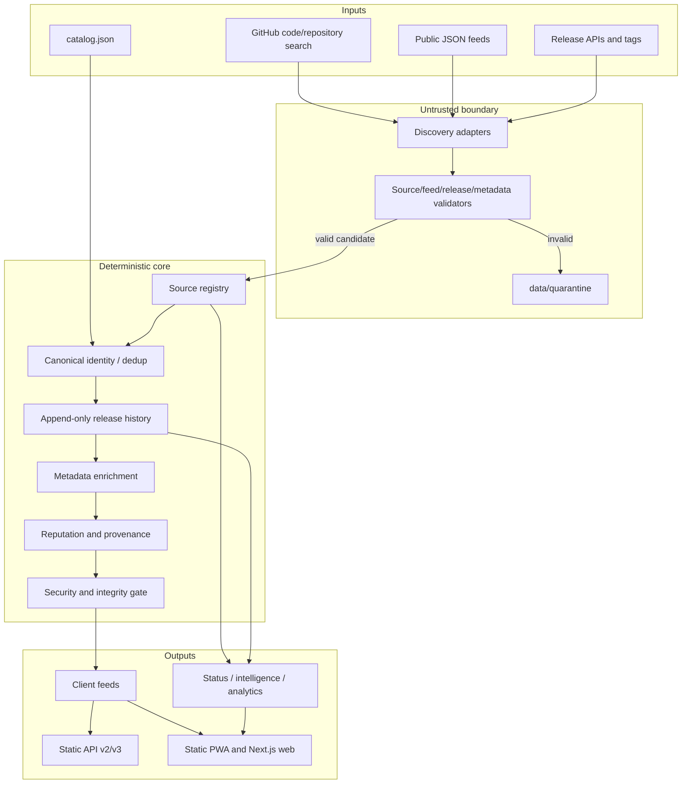

# OmniSource architecture

OmniSource is a source-quality and release-observability system. It is not a
social store: all catalog, collection, ranking, and health signals come from
committed source metadata, upstream release history, validation, or anonymous
availability probes. There are no accounts, ratings, reviews, comments,
behavioral profiles, or user-activity recommendations.

## System diagram

## Lifecycle

1. **Discover** — code search, repository search, feed probing, GitHub Pages
   links, and release scans create source candidates.
2. **Validate** — URL, schema, app identity, version, asset, icon, screenshot,
   metadata, duplicate, and release rules run without publication side effects.
3. **Quarantine** — invalid or not-yet-verified candidates are written only to
   `data/quarantine/sources.json`. The generated feed builder cannot consume
   that file.
4. **Verify** — provenance, reputation, health, release assets, and optional
   streamed SHA-256/SHA-512 checks establish a publication decision.
5. **Deduplicate** — bundle identifier, app identifier, repository URL, release
   URL, and binary URL/digest signals merge canonical records while retaining
   every source and historical release.
6. **Enrich** — metadata is normalized and only declared/observable values are
   filled; no publisher or download URL is guessed.
7. **Build incrementally** — changed source/app/release fingerprints rebuild
   only affected feeds/pages; unchanged JSON is not rewritten.
8. **Publish** — every output passes validation and the security gate before
   the workflow's narrow commit allow-list can publish it.
9. **Monitor and heal** — 30-minute anonymous probes update status, retry
   transient failures, switch only to recorded mirrors, and schedule rebuilds
   for missing metadata or releases.

## Boundaries and contracts

| Boundary | Contract | Failure behavior |
|---|---|---|
| HTTP provider | HTTPS API/feed URL, timeout, capped body, host-scoped token | retry/backoff; no token on download URLs |
| Discovery → validation | `data/discovered_sources.json` + discovery schema | malformed records go to quarantine |
| Validator → publisher | `ValidationResult` / no errors + verified status | fail closed; no partial feed publication |
| Core → persistence | `Repository` protocol | JSON now; SQLite/DB-API adapters later |
| Core → extensions | plugin protocols and event bus | unknown plugins are not imported |
| Feed → clients | AltStore Source v2-compatible envelope | generated client/single/collection variants are validated |
| API → consumers | versioned static snapshots and cacheable dynamic routes | v2 remains backward compatible |

## Persistence and migration

`src/omnisource/repository.py` defines a small document repository contract.
`JsonRepository` is used for Git-friendly snapshots, `SQLiteRepository` is
ready for a local service, and `DBAPIRepository` accepts parameterized DB-API
connections for PostgreSQL/MySQL deployments. Business services only depend
on `get`, `put`, `delete`, `list`, `count`, and `transaction`.

Operational events use `src/omnisource/events.py` and can be retained in the
JSONL outbox under `data/events/`. Event handlers are subscribers, not hidden
calls from feed generation. Metrics and structured logs are provided by
`src/omnisource/observability.py`.

## Web architecture

- `js/` is the zero-dependency GitHub Pages PWA and compatibility surface.
- `web/` is the Next.js 15 / TypeScript / Tailwind application for Node
  hosting. It consumes local snapshots during build and relative API routes at
  runtime; browser code never calls localhost.
- Eight lazy locale modules use English fallback and server-selected language
  state to avoid hydration mismatch.
- Search is field-weighted fuzzy search over source, developer, category, tag,
  bundle ID, and release metadata. It is not personalized.
- Feature flags are configuration, not user profiles. The canonical
  `config/feature_flags.json` is loaded fail-closed by
  `src/omnisource/feature_flags.py`.
- The static PWA status module is `js/modules/pwa.js`; the SDK regression
  fixture is `sdk/javascript/test.mjs` and runs through the SDK test command.

## Scale path

The default standard-library providers use bounded thread pools and HTTP
caches. `async_http.py` provides a single async API with an `aiohttp` pooled
backend when installed and an `asyncio.to_thread` fallback otherwise. The
same interfaces support approximately 1,000 sources / 10,000 apps; deployment
operators should shard discovery and monitoring jobs once rate limits rather
than CPU become the bottleneck.
